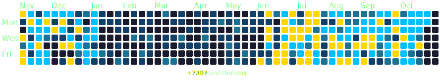

  <!-- Authorization for README inspiration -->
<!--
    Dear user using this README as a base,
    Thank you for the inspiration from similar designs!
    I believe in open collaboration and sharing knowledge.
-->

<!-- Banner -->

  

 

<h3 align="center">
  About Me
</h3> 

  
  
  <a href="https://github.com/rushhiii?tab=followers">
    <!--  -->
      
  </a>

 

    

  ▪ Currently developing my programming skills across multiple domains
   ▪ Exploring: C, C++, and UNIX systems
   ▪ Interested in large-scale projects that challenge my thinking
   ▪ Always willing to help others learn about programming
  
    
  
  Perfection isn't the goal. Precision is.

 

  <!-- Gmail -->
  
  
  
  <!--  -->

<!-- 🧩🔮🕶️⚙️⛓️📚 -->
<h3>
  Languages & Tools
</h3>

   
   
   
   

 

<!-- <h2>🏆 GitHub Trophy</h2>

  

 -->

<h3>
  GitHub Status
</h3>

 

<h3 align="center">
  Best Repositories
</h3>

  
  
  

 

<h3 align="center">
  Tech Stack
</h3>

  
  
  
  
  
  
  
  
   

  
  
  
  
  

   

  
  
  
  
  

   

  
  
  

 

<h3 align="center">
  Top Contributions & Dev Quote
</h3>

  
  

 

<h3 align="center">
  Contribution Heatmap
</h3>

  

  
My Coding Journey

  

    I still remember the first time I touched a computer with intention — it was in Grade 11. I signed up
    for a Computer Science course mostly out of curiosity, not knowing it would completely shift my future.
  

  

    Back then, I didn’t even know how to type properly. I had never written a line of code, barely used a
    laptop, and had no idea what programming really meant. But something about solving logic problems,
    getting code to work, and seeing instant results on screen hooked me.
  

  

    That high school course turned into a passion. I started exploring Java, building tiny console apps, and
    experimenting with whatever I could. Over time, I moved into web development, learned JavaScript and
    Python, and started automating tasks just for fun. What started as a curiosity became my obsession — and
    now my career path.
  

  

    Today, I'm a second-year Computer Science student at Toronto Metropolitan University, working on
    personal projects, learning new technologies, and building tools that make life easier or more
    meaningful. I’m still learning, still growing — and still loving every moment of it.
  

  

